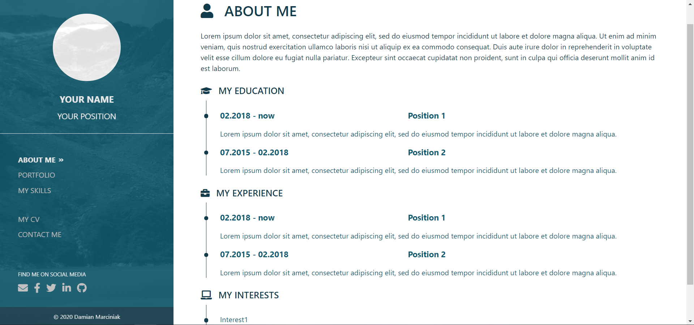
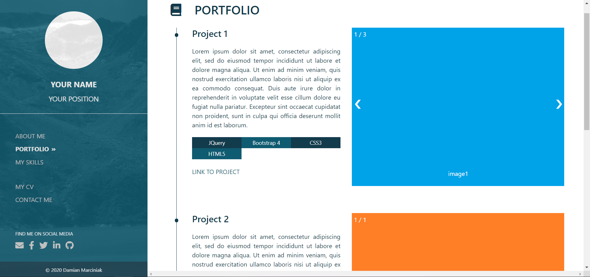
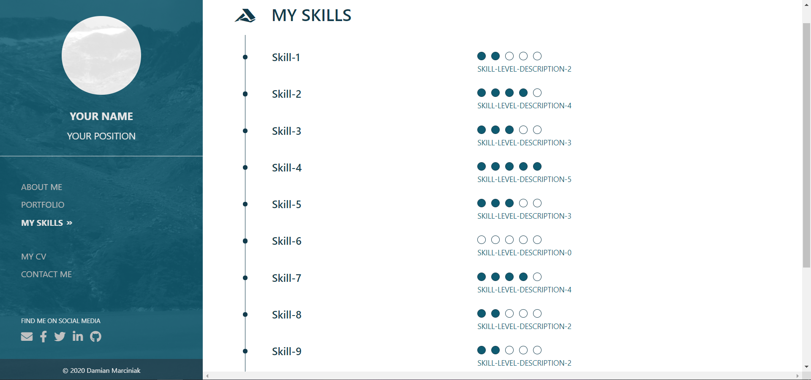
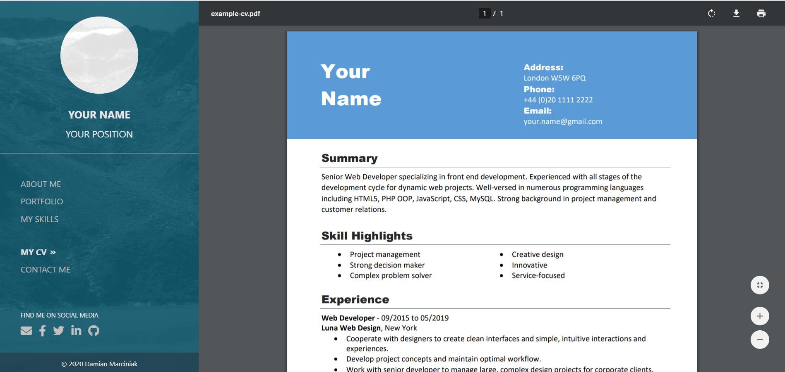
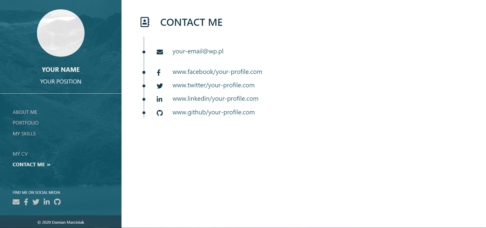

# Portfolio Template

Full responsive website with a portfolio template which includes below
sections:
* ABOUT ME - information about author (education, experience, interests)
* PORTFOLIO - information about author's projects
* MY SKILLS - author's skills
* MY CV - author's CV
* CONTACT ME - contact to author 

---

## Screenshots







---

## Technology
* HTML5
* CSS3 + Bootstrap 4
* JavaScript + JQuery

---

## Requirements
* web browser - Chrome, Edge, Firefox etc. (for running) 
* git CLI and heroku CLI installed (for deploying)

---

## Deploying & Running
Example for Linux system and Heroku cloud platform.

Run your terminal and type below commands: 
```
git clone https://github.com/dmarcini/portfolio-template
cd portfolio
rm -r .git

git init
git add *
git commit -m "Your commit name"

heroku login
heroku apps:create your-site-name
git push heroku master
```
After this step your site should be available on: <br>
https://your-site-name.herokuapp.com
